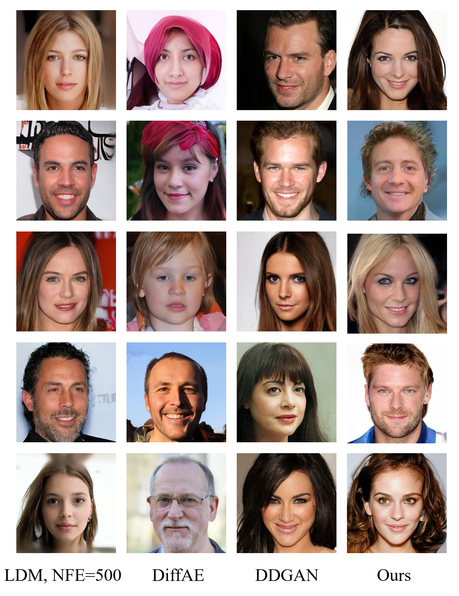
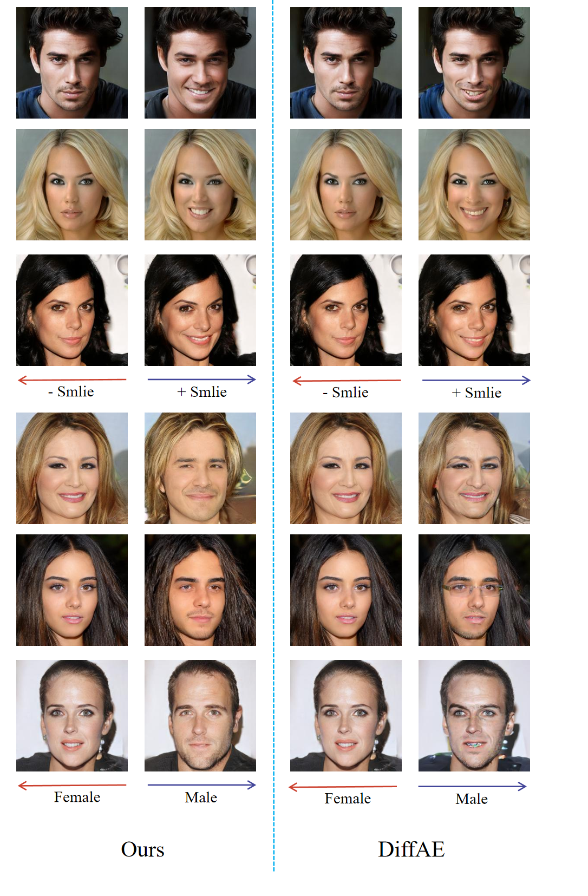

# Progressive-Image-Synthesis-from-Semantics-to-Details-with-Denoising-Diffusion-GAN

## Figure A

As shown in Figure A, when FID is low, generated images are all of high quality and the blurs or artifacts can be hardly identified.

## Figure B

As shown in Figure B, our model can generate natural and high-quality images with precise attribute. However, DiffAE can not manipulate the attributes naturally and tends to generate blurs and artifacts. In addition, the manipulation of DiffAE for gender is entangled with eyeglasses, while our model can precisely manipulate gender only while preserve other information of the images.
